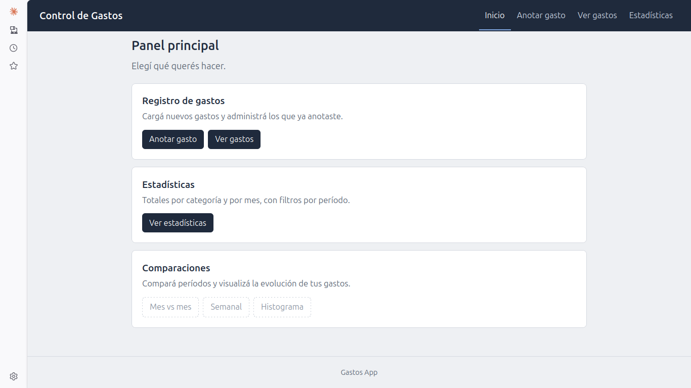

# 💰 Gastos – Control de gastos familiares

Aplicación web para registrar, consultar y analizar los gastos de una familia. Desarrollada con Python, Flask, SQLAlchemy y MySQL, con una arquitectura en capas pensada para crecer.

🔗 **Demo en vivo:** _(link al deploy)_



## ✨ Funcionalidades

- Registrar, listar, editar y eliminar gastos (CRUD completo)
- Estadísticas: resumen por categoría, por mes y total por categoría
- Menú principal con acceso rápido a cada operación
- Validación de datos (montos, fechas, campos obligatorios)
- Versión por consola y versión web sobre la misma lógica de negocio

🚧 **Próximamente:** comparaciones y gráficos (histogramas semanales/mensuales), múltiples usuarios.

## 🛠️ Tecnologías

| Área | Herramientas |
|------|--------------|
| Lenguaje | Python 3 |
| Web | Flask (Blueprints, Jinja2) |
| Base de datos | MySQL + SQLAlchemy |
| Control de versiones | Git / GitHub |

## 🏗️ Arquitectura

El proyecto separa responsabilidades en capas:

```
Gastos/
├── app.py                 # Punto de entrada web (Flask)
├── main.py                # Punto de entrada por consola
├── src/
│   ├── config/            # Conexión a la base de datos
│   ├── models/            # Modelos SQLAlchemy
│   ├── repositories/      # Acceso a datos
│   ├── services/          # Lógica de negocio (GastoService, EstadisticasService)
│   ├── controllers/       # Controladores de consola
│   └── web/               # Rutas, templates y estáticos de Flask
└── tests/
```

**Flujo:** ruta/controlador → servicio → repositorio → modelo → MySQL.
Los servicios no saben si se los llama desde la consola o desde la web, por eso se reutilizan en ambas.

## 🚀 Instalación

```bash
# 1. Clonar
git clone https://github.com/<tu-usuario>/<tu-repo>.git
cd <tu-repo>

# 2. Entorno virtual
python -m venv .venv
source .venv/bin/activate

# 3. Dependencias
pip install -r requirements.txt

# 4. Variables de entorno
cp .env.example .env     # completar con tus credenciales de MySQL

# 5. Crear la base de datos
mysql -u <usuario> -p -e "CREATE DATABASE db_gastos;"

# 6. Ejecutar
flask --app app run      # versión web
python main.py           # versión consola
```

## ⚙️ Configuración

Variables esperadas en `.env`:

```
DB_USER=
DB_PASSWORD=
DB_HOST=localhost
DB_PORT=3306
DB_NAME=db_gastos
```

## 🧪 Tests

```bash
pytest
```

## 🗺️ Roadmap

- [x] CRUD por consola
- [x] Estadísticas por categoría y mes
- [x] Interfaz web con Flask
- [ ] Paginación / agrupación por mes en el listado
- [ ] Gráficos comparativos
- [ ] Usuarios y login para la familia
- [ ] Deploy público

## 👤 Autor

**<Ricardo Rojas>** – [GitHub](https://github.com/rirojas1970-create/db_gastos/edit/main/README.md) Email: (rirojas1970@hmail.com)
