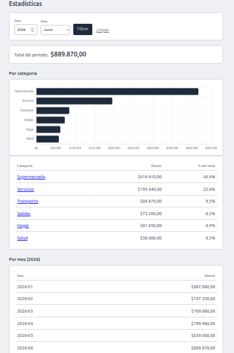
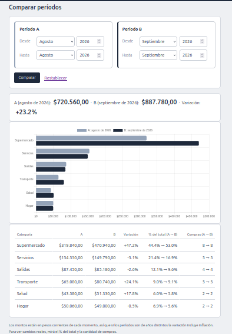

# 💰 Gastos – Control de gastos familiares

Aplicación web para registrar, consultar y analizar los gastos de una familia. Desarrollada con Python, Flask, SQLAlchemy y MySQL, con una arquitectura en capas pensada para crecer.

🔗 **Demo en vivo:** _(link al deploy)_


## ✨ Funcionalidades

- Registrar, listar, editar y eliminar gastos (CRUD completo)
- **Estadísticas** con filtros por año y mes: total del período, gráfico y tabla por categoría, y resumen mensual
- **Detalle por categoría:** qué lugares o productos componen el total de cada una, con gráfico de barras
- **Comparar períodos:** dos rangos libres (desde/hasta, mes y año) con variación, porcentaje del total y cantidad de compras por categoría
- Menú principal con acceso rápido a cada operación
- Validación de datos (montos, fechas, campos obligatorios)
- Versión por consola y versión web sobre la misma lógica de negocio

## 📸 Capturas

> Las capturas usan datos ficticios generados con `scripts/generar_datos_demo.py`.

**Estadísticas**



**Comparar períodos**



## 🛠️ Tecnologías

| Área | Herramientas |
|------|--------------|
| Lenguaje | Python 3 |
| Web | Flask (Blueprints, Jinja2) |
| Base de datos | MySQL + SQLAlchemy |
| Control de versiones | Git / GitHub |

## 🏗️ Arquitectura

El proyecto separa responsabilidades en capas:

```
Gastos/
├── app.py                 # Punto de entrada web (Flask)
├── main.py                # Punto de entrada por consola
├── scripts/               # Utilidades (datos ficticios para demo)
├── docs/img/              # Capturas para el README
└── src/
    ├── config/            # Conexión a la base de datos
    ├── models/            # Modelos SQLAlchemy
    ├── repositories/      # Acceso a datos
    ├── services/          # Lógica de negocio (GastoService, EstadisticasService)
    ├── controllers/       # Controladores de consola
    └── web/               # Rutas, templates y estáticos de Flask
```

**Flujo:** ruta/controlador → servicio → repositorio → modelo → MySQL.
Los servicios no saben si se los llama desde la consola o desde la web, por eso se reutilizan en ambas.

## 🚀 Instalación

```bash
# 1. Clonar
git clone https://github.com/rirojas1970-create/db_gastos.git
cd db_gastos

# 2. Entorno virtual
python -m venv .venv
source .venv/bin/activate

# 3. Dependencias
pip install -r requirements.txt

# 4. Variables de entorno
cp .env.example .env     # completar con tus credenciales de MySQL

# 5. Crear la base de datos
mysql -u <usuario> -p -e "CREATE DATABASE db_gastos;"

# 6. Ejecutar
flask --app app run      # versión web
python main.py           # versión consola
```

## ⚙️ Configuración

Variables esperadas en `.env`:

```
DB_USER=
DB_PASSWORD=
DB_HOST=localhost
DB_PORT=3306
DB_NAME=db_gastos
```

## 🎭 Probar con datos de ejemplo

Para ver las estadísticas y comparaciones funcionando sin cargar gastos a mano:

1. Creá una base cuyo nombre termine en `_demo` (por ejemplo `db_gastos_demo`) y dale permisos a tu usuario de MySQL.
2. En el `.env`, poné `DB_NAME=db_gastos_demo`.
3. Ejecutá el script desde la raíz del proyecto:

```bash
python -m scripts.generar_datos_demo
```

El script solo corre sobre bases `_demo` y solo si están vacías, para no mezclar datos ficticios con gastos reales.

## 🗺️ Roadmap

- [x] CRUD por consola
- [x] Interfaz web con Flask
- [x] Estadísticas por categoría y mes, con filtros
- [x] Detalle por categoría con gráfico
- [x] Comparar períodos
- [ ] Evolución mensual


## 👤 Autor

**Ricardo Rojas** – [GitHub](https://github.com/rirojas1970-create) · rirojas1970@hmail.com